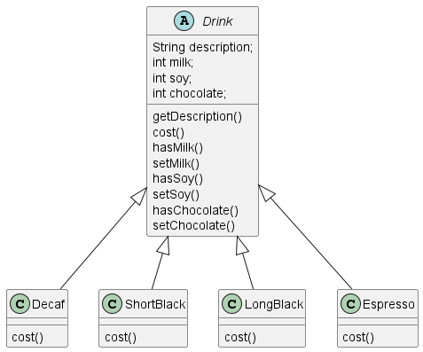
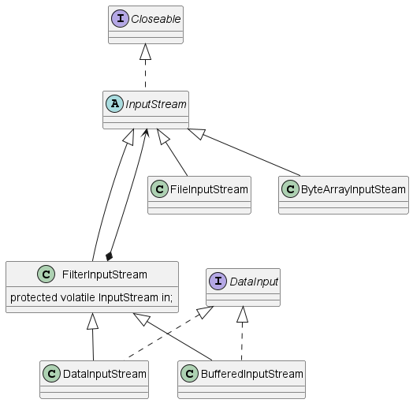
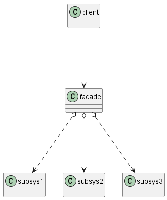
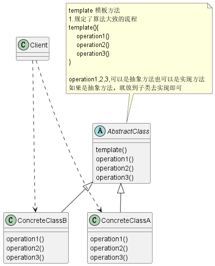

# Java设计模式

按照大话设计模式来梳理设计模式。七大设计原则

- 单一职责（简单来说，每个类或函数负责的功能要相对独立，保持高内聚）
- 接口隔离（类不应该包含实现其不需要的接口方法，接口拆分）
- 依赖倒置（高层不应依赖底层，面向抽象编程）
- 里式替换（子类最好不要改变父类已实现的方法，保证子类调实现用父类的方法与父类调用保持一致）
- 开闭原则（最重要，代码设计应该对修改关闭，对扩展开放）
- 迪米特原则（最小知道，类的方法不应该包含与其无关的类，保持低耦合）
- 合成复用原则（多用组合，少用继承，降低耦合性，提高扩展）

UML类图中类的关系有：依赖（....>）、关联（---->）、泛化（<|-----）、实现（<|.....）、聚合（o----）、组合（*-----）

几种关系的理解：

- 依赖关系：简单理解为在某个方法里通过传参的方式用到了某个类或者返回了某个类（耦合度低）
- 关联关系：简单理解为类里面有属性引用了另一个类（耦合度中），关联关系的两种特例是聚合与组合
- 泛化关系：表示类之间的继承关系（关系紧密）
- 实现关系：表示接口与实现类之间的关系（关系紧密）
- 聚合关系：表示整体和部分，整体可以脱离部分存在。简单理解为整体类的有属性引用了部分类（set方法）（耦合度略高）
- 组合关系：表示整体和部分，相比组合关系更为紧密，不能单独存在。简单理解为整体类在构造的时候，必须将部分类的属性值设置进去否则不能创建整体类（构造时初始化必要的属性）（耦合度高）

23种设计模式，按功能可分为创建型、结构型、行为型三种。

创建型：单例、抽象工厂、原型、建造者、工厂

结构型：适配器、桥接、装饰器、组合、外观、享元、代理

行为型：模板方法、命令、访问者、迭代器、观察者、中介者、备忘录、解释器、状态、策略、职责链（责任链）

### 单例模式

1）[饿汉式（静态常量）](src/main/java/com/wzy/singleton/type1/SingletonTest01.java)

2）[饿汉式（静态代码块）](src/main/java/com/wzy/singleton/type2/SingletonTest02.java)

3）[~~懒汉式（线程不安全）~~](src/main/java/com/wzy/singleton/type3/SingletonTest03.java)

4）[~~懒汉式（线程安全、同步方法）~~](src/main/java/com/wzy/singleton/type4/SingletonTest04.java)

5）[~~懒汉式（线程安全、同步代码块）~~](src/main/java/com/wzy/singleton/type5/SingletonTest05.java)

6）[懒汉式 - 双重检查（线程安全、效率高、推荐）](src/main/java/com/wzy/singleton/type6/SingletonTest06.java)

7）[静态内部类（线程安全、推荐）](src/main/java/com/wzy/singleton/type7/SingletonTest07.java)

8）[枚举（线程安全、防御反射攻击、防御序列化攻击，推荐）](src/main/java/com/wzy/singleton/type8/SingletonTest08.java)

JDK中java.lang.Runtime类使用了单例模式（饿汉式）

### 简单工厂模式

示例：制造披萨饼

具体需求：

```
要便于披萨种类的扩展、要便于维护
1）披萨的种类很多（比如GreekPizza、CheesePizza等）
2）披萨的制作有prepare、bake、cut、box
3）完成披萨店的订购功能
```

初级版本UML

[实现代码](src/main/java/com/wzy/factory/simplefactory/pizzastore/ugly/order/PizzaStore.java)


简单工厂模式介绍：

1. 简单工厂模式属于创建型模式，是工厂模式的一种。**简单工厂模式是由一个工厂对象决定创建出哪一种产品类的实例**。简单工厂模式时工厂家族中最简单实用的模式。
2. 简单工厂模式：定义了一个创建对象的类，由这个类来**封装实例化对象的行为**（代码）
3. 在软件开发过程中，当我们会用到大量的创建某种、某类或者某批对象时，就会用到工厂模式。

[实现代码](src/main/java/com/wzy/factory/simplefactory/pizzastore/ugly/order/PizzaStore.java)


使用简单工厂UML

[实现代码](src/main/java/com/wzy/factory/simplefactory/pizzastore/advance/order/PizzaStore.java)


JDK中的Calendar类中，就使用了简单工厂模式


### 工厂方法模式

示例：披萨

```
披萨项目新的需求：客户在点披萨时，可以点不同口味的披萨，比如北京的奶酪pizza、北京的胡椒pizza、伦敦的奶酪pizza、伦敦的胡椒pizza

思路1
使用简单工厂模式，创建不同的简单工厂类，比如BJPizzaSimpleFactory、LDPizzaSimpleFactory等等。从当前这个案例来说，也是可以的，但是考虑到项目的规模，以及软件的可维护性、可扩展性并不是特别好

思路2
使用工厂方法模式
```

工厂方法模式介绍

1. 工厂方法模式设计方案：将披萨项目的实例化功能抽象成抽象方法，在不同的口味点餐子类中具体实现。一定程度上通过加层给大工厂（OrderPizza）加上小工厂(BJOrderPizza)

2. 工厂方法模式：定义了一个创建对象的抽象方法，由子类决定要实例化的类。工厂方法模式将**对象的实例化推迟到子类**。


使用工厂方法UML

[实现代码](src/main/java/com/wzy/factory/factorymethod/pizzastore/order/PizzaStore.java)


### 抽象工厂模式

示例：披萨饼

抽象工厂模式介绍：

1. 抽象工厂模式：定义了一个**interface**用于创建相关或有依赖关系的对象簇，而无需指明具体的类
2. 抽象工厂模式可以将**简单工厂模式**和**工厂方法模式**进行整合。
3. 从设计层面看，抽象工厂模式就是对简单工厂模式的改进（或者称为进一步的抽象）。
4. 将工厂抽象成两层，AbsFactory(抽象工厂)和具体实现的工厂子类。程序员可以根据创建对象类型使用对应的工厂子类。这样将单个的简单工厂类变成了**工厂簇**，更利于代码的维护和扩展。

使用抽象工厂UML

[实现代码](src/main/java/com/wzy/factory/abstractfactory/pizzastore/order/PizzaStore.java)


##### 工厂模式小结

1. 工厂模式的意义:将实例化对象的代码提取出来，放到一个类中统一管理和维护，达到和主项目的依赖关系的解耦。从而提高项目的扩展和维护性
2. 三种工厂模式（简单工厂、工厂方法、抽象工厂）
3. 设计模式的**依赖抽象**原则

- 创建对象实例时，不要直接new类，而是把这个new类的动作放在一个工厂的方法中，并返回。有的书上说，变量不要直接持有具体类的引用
- 不要让类继承具体类，而是继承抽象类或者是实现interface（接口）
- 不要覆盖基类中已经实现的方法（里式替换）


### 原型模式

克隆羊问题

```
现在有一只羊tom，姓名为tom，年龄为1，颜色为白色，请编写程序创建和tom羊属性完全相同的10只羊
```

传统方式解决克隆羊问题

传统方式UML


[实现代码](src/main/java/com/wzy/prototype/Client.java)

传统方式优缺点：

1）优点是比较好理解，简单易操作

2）在创建新的对象时，总是需要重新获取原始对象的属性，如果创建的对象比较复杂时，效率较低

3）总是需要重新初始化对象，而不是动态地获得对象运行时的状态，不够灵活

4）改进的思路分析

思路：Java中的Object类是所有类的根类，Object类提供了一个clone()方法，该方法可以将一个Java对象复制一份，但是需要实现clone的java类必须要实现一个接口Cloneable，该接口表示该类能够复制且具有复制的能力=>原型模式

**原型模式介绍**

1）原型模式（Prototype模式）是指：用原型实例指定创建对象的种类，并且通过拷贝这些原型，创建新的对象

2）原型模式时一种创建型设计模式，允许一个对象再创建另外一个可定制的对象，无需知道如何创建的细节

3）工作原理是：通过将一个原型对象传给那个要发动创建的对象，这个要发动创建的对象通过请求原型对象拷贝它们自己来实施创建，即 对象.clone()

4）形象的理解：孙大圣拔出猴毛，变出其它孙大圣

原型模式UML

[实现代码](src/main/java/com/wzy/prototype/advance/Client.java)


原理结构图说明：

1）Prototype：原型类，声明一个克隆自己的接口，可以理解为Object类

2）ConcretePrototype：具体的原型类，实现一个克隆自己的操作，可以理解为Sheep类，Cat类

3）Client：让一个原型对象克隆自己，从而创建一个新的对象（属性一样）

##### 原型模式在Spring框架中源码分析

1）Spring中原型bean的创建，就是原型模式的应用

2）代码分析  [实现代码](src/main/java/com/wzy/prototype/spring/test/ProtoType.java)

```xml
beans.xml
<bean id="id01" class = "com.atguigu.spring.bean.Monster" scope="prototype"/>
```

```java
Test.java
ApplicationContext applicationContext = new ClassPathXmlApplicationContext("beans.xml");
//获取monster[通过id获取monster]
Object bean = applicationContext.getBean("id01");
System.out.println("bean"+bean);

@Override
public Object getBean(String name) throws BeansException{
	return doGetBean(name,null,null,false);
}
```

浅拷贝-深拷贝  [实现代码](src/main/java/com/wzy/prototype/deepclone/Client.java)

```
浅拷贝的方式，就是说基本数据类型采用值传递，引用数据类型采用不同引用指向同一个对象，即引用传递
浅拷贝意味着原对象修改引用数据对象属性，拷贝对象的属性跟着改变
浅拷贝是使用默认clone()方法来实现 super.clone()
如果要采用深拷贝的方式，需要为所有引用数据类型的成员变量申请空间，并复制每个引用数据类型成员变量所引用的对象。
深拷贝实现方式1：需要重写clone()方法来实现
深拷贝实现方式2：通过对象序列化实现深拷贝
```

1.[重写clone()完成深拷贝](src/main/java/com/wzy/prototype/deepclone/DeepProtoType.java)

2.[通过对象序列化完成深拷贝 - deepcopy](src/main/java/com/wzy/prototype/deepclone/DeepProtoType.java)

##### 原型模式小结

1）创建新的对象比较复杂时，可以利用原型模式**简化对象的创建过程**，**同时也能够提高**效率

2）不用重新初始化对象，而是**动态地获得对象运行时**的状态（原始对象变化后再拷贝对象也发生改变）

3）如果原始对象发生变化（增加或者减少属性），其它克隆对象的也会发生相应的变化，无需修改代码

4）在实现深克隆的时候可能需要比较复杂的代码

5）缺点：需要为每一个类配备一个克隆方法，这对全新的类来说不是很难，但对已有的类进行改造时，需要修改其源代码，违背了ocp原则。


### 建造者模式

盖房项目

```
1) 需要建房子：这一过程为打桩、砌墙、封顶
2) 房子有各种各样的，比如普通房，高楼，别墅，各种房子的过程虽然一样，但是要求不要相同的.
3) 请编写程序，完成需求
```

传统方式UML  [实现代码](src/main/java/com/wzy/builder/Client.java)


**传统方式解决盖房需求问题分析**

1) 优点是比较好理解，简单易操作。

2) 设计的程序结构，过于简单，没有设计缓存层对象，程序的扩展和维护不好. 也就是说，这种设计方案，把产品(即：房子) 和 创建产品的过程(即：建房子流程) 封装在一起，耦合性增强了。

3) 解决方案：将**产品和产品建造过程解耦** => 建造者模式.

**建造者模式基本介绍**

1) 建造者模式（Builder Pattern）又叫生成器模式，是一种对象构建模式。它可以将复杂对象的建造过程抽象出来（抽象类别），使这个抽象过程的不同实现方法可以构造出不同表现（属性）的对象。

2) 建造者模式 是一步一步创建一个复杂的对象，它允许用户只通过指定复杂对象的类型和内容就可以构建它们，用户不需要知道内部的具体构建细节。

**建造者模式的四个角色**

**1) Product**（产品角色）： 一个具体的产品对象。Houser

**2) Builder**（抽象建造者）： 创建一个Product对象的各个部件指定的 接口/**抽象类**。HouseBuilder

**3) ConcreteBuilder**（具体建造者）： 实现接口，构建和装配各个部件。CommonBuilder

**4) Director**（指挥者）： 构建一个使用Builder接口的对象。它主要是用于创建一个复杂的对象。它主要有两个作用，一是：**隔离了客户与对象的生产过程**，二是：负责**控制**产品**对象的生产过程**。HouseDirector

建造者模式UML  [实现代码](src/main/java/com/wzy/builder/advance/Client.java)


**建造者模式在JDK的应用和源码分析**

1) java.lang.StringBuilder中的建造者模式

2) 代码说明+Debug源码

3) 源码中建造者模式角色分析

- Appendable 接口定义了多个append方法(抽象方法), 即Appendable 为抽象建造者, 定义了抽象方法
- AbstractStringBuilder 实现了 Appendable 接口方法，这里的AbstractStringBuilder 已经是建造者，只是不能实例化
- StringBuilder 即充当了指挥者角色，同时充当了具体的建造者，建造方法的实现是由 AbstractStringBuilder 完成, 而StringBuilder 继承了AbstractStringBuilder 

**建造者模式的注意事项和细节**

1) 客户端(使用程序)**不必知道产品内部组成的细节，将产品本身与产品的创建过程解耦，使得相同的创建过程可以创建不同的产品对象**

2) 每一个具体建造者都相对独立，而与其他的具体建造者无关，因此可以很方便地替换具体建造者或增加新的具体建造者， **用户使用不同的具体建造者即可得到不同的产品对象**

3) **可以更加精细地控制产品的创建过程** 。将复杂产品的创建步骤分解在不同的方法中，使得创建过程更加清晰，也更方便使用程序来控制创建过程

4) **增加新的具体建造者无须修改原有类库的代码**，指挥者类针对抽象建造者类编程，系统扩展方便，符合 **“开闭原则”**

5) 建造者模式所创建的产品一般具有较多的共同点，其组成部分相似，**如果产品之间的差异性很大，则不适合使用建造者模式**，因此其使用范围受到一定的限制。

6) 如果产品的内部变化复杂，可能会导致需要定义很多具体建造者类来实现这种变化，导致系统变得很庞大，因此在这种情况下，要考虑是否选择建造者模式.

7) **抽象工厂模式** VS **建造者模式**

抽象工厂模式实现对产品家族的创建，一个产品家族是这样的一系列产品：具有不同分类维度的产品组合，采用**抽象工厂模式**不需要关心构建过程，**只关心**什么产品由什么工厂生产即可。而**建造者模式**则是要求**按照指定**的蓝图建造产品，它的主要目的是**通过组装零配件**而产生一个**新产品**（抽象过程的不同实现可以构造不同表现的对象）

[建造者模式讲解](https://zhuanlan.zhihu.com/p/58093669)


### 适配器模式

电源适配器案例

```
类适配器模式介绍
基本介绍：Adapter类，通过继承 src类，实现 dst 类接口，完成src->dst的适配。
类适配器模式应用实例
应用实例说明
以生活中充电器的例子来讲解适配器，充电器本身相当于Adapter，220V交流电
相当于src (即被适配者)，我们的目dst(即 目标)是5V直流电
```


**适配器模式基本介绍**

1) 适配器模式(Adapter Pattern)将某个类的接口转换成客户端期望的另一个接口表示，主的目的是兼容性，让原本因接口不匹配不能一起工作的两个类可以协同工作。其别名为包装器(Wrapper)

2) 适配器模式属于结构型模式

3) 主要分为三类：类适配器模式、对象适配器模式、接口适配器模式

**工作原理**

1) 适配器模式：将一个类的接口转换成另一种接口.让**原本接口不兼容的类可以**兼容

2) 从用户的角度看不到被适配者，是解耦的

3) 用户调用适配器转化出来的目标接口方法，适配器再调用被适配者的相关接口方法

4) 用户收到反馈结果，感觉只是和目标接口交互

类适配器UML  [实现代码](src/main/java/com/wzy/adapter/classadapter/Client.java)


对象适配器UML  [实现代码](src/main/java/com/wzy/adapter/objectadapter/Client.java)


接口适配器UML  [代码示例](src/main/java/com/wzy/adapter/interfaceadapter/Client.java)


1) 一些书籍称为：适配器模式(Default Adapter Pattern)或缺省适配器模式。

2) 当不需要全部实现接口提供的方法时，可先设计一个抽象类实现接口，并为该接口中每个方法提供一个默认实现（空方法），那么该抽象类的子类可有选择地覆盖父类的某些方法来实现需求。

3) 适用于一个接口不想使用其所有的方法的情况。


##### **适配器模式在SpringMVC框架应用的源码剖析**

1) **SpringMVC**中的HandlerAdapter, **就使用了适配器模式**

2) SpringMVC处理请求的流程回顾

3) 使用HandlerAdapter 的原因分析：

```
可以看到处理器的类型不同，有多重实现方式，那么调用方式就不是确定的。
如果需要直接调用Controller方法，需要调用的时候就得不断是使用if else来进行判断是哪一种子类然后执行。
那么如果后面要扩展Controller，就得修改原来的代码，这样违背了OCP原则。
```

4) 动手模拟SpringMVC通过**适配器设计模式**获取到对应的Controller的源码 [代码实现](src/main/java/com/wzy/adapter/springmvc/DispatchServlet.java)

**说明：**

• Spring定义了一个适配接口，使得每一种Controller有一种对应的适配器实现类

• 适配器代替controller执行相应的方法

• 扩展Controller 时，只需要增加一个适配器类就完成了SpringMVC的扩展了


### 桥接模式

手机操作问题

现在对不同手机类型的不同品牌实现操作编程(比如:开机、关机、上网，打电话等)


**传统方案解决手机操作问题分析**

1) 扩展性问题(类爆炸)，如果我们再增加手机的样式(旋转式)，就需要增加各个品牌手机的类，同样如果我们增加一个手机品牌，也要在各个手机样式类下增加。

2) 违反了单一职责原则，当我们增加手机样式时，要同时增加所有品牌的手机，这样增加了代码维护成本.

3) 解决方案-使用桥接模式

**桥接模式（Bridge）— 基本介绍**

1) 桥接模式(Bridge模式)是指：将**实现**与**抽象**放在两个不同的类层次中，使两个层次可以独立改变。

2) 是一种结构型设计模式

3) Bridge模式基于**类的最小设计原则**，通过使用**封装、聚合及继承**等行为让不同的类承担不同的职责。它的主要特点是把抽象(Abstraction)与行为实现(Implementation)分离开来，从而可以保持各部分的独立性以及应对他们的功能扩展

桥接模式UML  [实现代码](src/main/java/com/wzy/bridge/Client.java)


**桥接模式在JDBC的源码剖析**

1) Jdbc 的 Driver接口，如果从桥接模式来看，Driver就是一个接口，下面可以有MySQL的Driver，Oracle的Driver，这些就可以当做实现接口类

2) 代码分析+Debug源码

jdbc接口UML


**桥接模式小结**

1) 实现了**抽象和实现部分的分离**，从而极大的提供了系统的灵活性，让抽象部分和实现部分独立开来，这有助于系统进行分层设计，从而产生更好的结构化系统。

2) 对于系统的高层部分，只需要知道抽象部分和实现部分的接口就可以了，其它的部分由具体业务来完成

3) 桥接模式**替代多层继承**方案，可以减少子类的个数，降低系统的管理和维护成本

4) 桥接模式由于**聚合关联**关系建立在**抽象层**，要求开发者针对抽象进行设计和编程

**桥接模式其它应用场景**

1) 对于那些不希望使用继承或因为多层次继承导致系统类的个数急剧增加的系统，桥接模式尤为适用.

2) 常见的应用场景:

- JDBC驱动程序
- 银行转账系统
- 转账分类: 网上转账，柜台转账，AMT转账
- 转账用户类型：普通用户，银卡用户，金卡用户..
- 消息管理
- 消息类型：即时消息，延时消息
- 消息分类：手机短信，邮件消息，QQ消息...

### 装饰器模式

星巴克咖啡订单问题

```
星巴克咖啡订单项目（咖啡馆）：
1) 咖啡种类/单品咖啡：Espresso(意大利浓咖啡)、ShortBlack、LongBlack(美式咖啡)、Decaf(无因咖啡)
2) 调料：Milk、Soy(豆浆)、Chocolate
3) 要求在扩展新的咖啡种类时，具有良好的扩展性、改动方便、维护方便
4) 使用OO的来计算不同种类咖啡的费用: 客户可以点单品咖啡，也可以单品咖啡+调料组合。
```

方案一：通过排列组合继承咖啡Drink 导致类爆炸

方案一 UML类图


方案一 解决咖啡问题分析：

方案二 UML类图



1) Drink 是一个抽象类，表示饮料

2) des就是对咖啡的描述, 比如咖啡的名字

3) cost() 方法就是计算费用，Drink 类中做成一个抽象方法.

4) Decaf 就是单品咖啡， 继承Drink, 并实现cost

5) Espress && Milk 就是单品咖啡+调料， 这个组合很多

6) 问题：这样设计，会有很多类，当我们增加一个单品咖啡，或者一个新的调料，类的数量就会倍增，就会出现类爆炸


方案二：将调料内置到Drink类，这样就不会造成类数量过多

说明：milk，soy，chocolate可以设计为Boolean，表示是否要添加相应的调料

方案二 解决咖啡问题分析

1) 方案2可以控制类的数量，不至于造成很多的类

2) 在**增加或者删除调料种类**时，代码的维护量很大

3) 考虑到用户可以添加多份 调料时，可以将hasMilk 返回一个对应int

4) 考虑使用 装饰者 模式


**装饰者模式定义**

  **动态的**将新功能**附加到对象上**。在对象功能扩展方面，它比继承更有弹性，装饰者模式也体现了开闭原则(ocp)。类似俄罗斯套娃。

**装饰者模式原理**

1）装饰者模式就像**打包一个快递**

主体：比如，陶瓷、衣服（Component）//被装饰者

包装：比如，报纸填充、塑料泡沫、纸板、木板（Decorator）

2）Component

主体：比如类似Drink

3）ConcreteComponent和Decorator

​	ConcreteComponent：具体的主体，比如前面的各个单品咖啡

​	Decorator：装饰者，比如各调料

4）在Component与ConcreteComponent之间，如果ConcreteComponent类很多，还可以设计缓冲层，将共有部分提取出来，抽象层一个类

方案三：使用装饰者模式设计

方案三 UML类图  [实现代码](src/main/java/com/wzy/decorator/Client.java)


**装饰者模式在JDK应用的源码分析**

Java的IO结构，FilterInputStream就是一个装饰者（Decorator），InputStream是被装饰者类（Component）

```
说明：
1.InputStream 是抽象类，类似我们前面讲的Drink
2.FileInputStream 是InputStream子类，类似我们前面的DeCaf，LongBlack
3.FilterInputStream 是InputStream子类：类似我们前面的Decorator修饰者
4.DataInputStream 是 FilterInputStream子类，具体的修饰者，类似前面的Milk，Soy等
```

[InputStream代码](src/main/java/com/wzy/decorator/inputstream/Decorator.java)

InputStream UML类图



**装饰者模式小结**

```
装饰者模式主要强调对原有被包装类功能的增强，提供了动态附加新功能的效果。
```

**桥接模式与装饰者模式区别**

```
桥接模式的定义是将抽象化与实现化分离（用组合的方式而不是继承的方式），使得两者可以独立变化。可以减少派生类的增长。这样看起来和装饰者差不多，但两者还是有一些比较重要的区别：

1. 桥接模式中所说的分离，其实是指将结构与实现分离（当结构和实现有可能发生变化时）或属性与基于属性的行为进行分离；而装饰者只是对基于属性的行为进行封闭成独立的类。

2. 桥接中的行为是横向的行为，行为彼此之间无关联；而装饰者模式中的行为具有可叠加性，其表现出来的结果是一个整体，一个各个行为组合后的一个结果。
```


### 组合模式

学校院系展示需求问题

```
编写程序展示一个学校院系结构：需求是这样，要在一个页面中展示出学校的院系组成，一个学校有多个学院，一个学院有多个系。
如下：
------------清华大学-----------------------
---------计算机学院---------
计算机科学与技术
软件工程
网络工程
--------信息工程学院---------
通信工程
信息工程
```

解决方案：

把学校、院、系**都看做**是组织结构，他们之间没有继承的关系，而是一个树形结构，可以更好的实现管理操作。 => 组合模式


**组合模式基本介绍**

1) 组合模式（Composite Pattern），又叫部分整体模式，它创建了对象组的树形结构，将对象组合成树状结构以表示“整体-部分”的层次关系。

2) 组合模式依据树形结构来组合对象，用来表示部分以及整体层次。

3) 这种类型的设计模式属于结构型模式。

4) 组合模式使得用户对单个对象和组合对象的访问具有一致性，**即**：组合能让客户以一致的方式处理个别对象以及组合对象

组合模式UML类图


**组合模式结构图说明**

1）Component：这是组合中对象声明接口，在适当情况下，实现所有类共有的接口默认行为，用于访问和管理Component子部件，Component可以使抽象类或接口

2）Leaf：在组合中表示叶子节点，叶子结点没有子节点

3）Composite：非叶子节点，用于存储子部件，在Component接口中实现子部件的相关操作，比如增加(add)，删除

**解决的问题**

组合模式解决这样的问题，当我们的要处理的对象可以生成一颗树形结构，而我们要对树上的节点和叶子进行操作时，它能够提供一致的方式，而不用考虑

它是节点还是叶子。


院校展示UML  [实现代码](src/main/java/com/wzy/composite/Client.java)


**组合模式在JDK集合的源码分析**

Java的集合类-HashMap就使用了组合模式  put(K,V) 和 putAll(Map<? extends K,? extends V>)

```
说明
1.Map就是一个抽象的构建（类似我们的Component）
2.HashMap是一个中间的构建（Composite）,实现/继承了相关方法
   put,putAll
3.Node是HashMap的静态没不累，类似Leaf叶子节点，这里就没有put,putAll
	static class Node<K,V> implements Map.Entry<K,V>
```


HashMap的UML


**组合模式的注意事项和细节**

1) 简化客户端操作。客户端只需要面对一致的对象而不用考虑整体部分或者节点叶子的问题。

2) 具有较强的扩展性。当我们要更改组合对象时，我们只需要调整内部的层次关系，客户端不用做出任何改动.

3) 方便创建出复杂的层次结构。客户端不用理会组合里面的组成细节，容易添加节点或者叶子从而创建出复杂的树形结构

4) 需要遍历组织机构，或者处理的对象具有树形结构时, 非常适合使用组合模式.

5) 要求较高的抽象性，**如果节点和叶子有很多差异性的话**，比如很多方法和属性都不一样，不适合使用组合模式


### 外观模式

影院管理项目

```
组建一个家庭影院：
DVD播放器、投影仪、自动屏幕、环绕立体声、爆米花机,要求完成使用家庭影院的功能，其过程为：
• 直接用遥控器：统筹各设备开关
• 开爆米花机
• 放下屏幕
• 开投影仪
• 开音响
• 开DVD，选dvd
• 去拿爆米花
• 调暗灯光
• 播放
• 观影结束后，关闭各种设备
```

传统方式

```
//1. 创建相关的对象
//2. 调用创建的各个对象的一系列方法
//3. 调用DVDPlayer 对象的play方法
```

传统方式解决影院管理问题分析

1) 在ClientTest 的main方法中，创建各个子系统的对象，并直接去调用子系统(对象)相关方法，会造成调用过程混乱，没有清晰的过程

2) 不利于在ClientTest 中，去维护对子系统的操作

3) 解决思路：定义一个高层接口，给子系统中的一组接口提供一个**一致的界面(比如在高层接口提供四个方法 ready, play, pause, end )**，用来访问子系统中的一群接口

4) 也就是说就是通过定义一个一致的接口(界面类)，用以屏蔽内部子系统的细节，使得调用端只需跟这个接口发生调用，而无需关心这个子系统的内部细节 => 外观模式

基本介绍

1) 外观模式（Facade），也叫"过程模式"：外观模式为子系统中的一组接口提供一个一致的界面，此模式定义了一个高层接口，这个接口使得这一子系统更加容易使用

2) 外观模式通过定义一个一致的接口，用以屏蔽内部子系统的细节，使得调用端只需跟这个接口发生调用，而无需关心这个子系统的内部细节

外观模式UML



外观模式类图说明：

1）外观类（Facade）:为调用端提供统一的调用接口，外观类知道那些子系统负责处理请求，从而将调用端的请求代理给适当子系统对象

2）调用者（client）：外观接口的调用者

3）子系统集合：指模块或子系统，处理Facade对象指派的任务，它是功能的提供者

家庭影院UML  [实现代码](src/main/java/com/wzy/facade/Client.java)


外观模式在MyBatis框架应用的源码分析

MyBatis 中的Configuration 去创建MetaObject 对象使用到外观模式

Mybatis中Configuration的UML


**外观模式的注意事项和细节**

1) 外观模式对外屏蔽了子系统的细节，因此外观模式降低了客户端对子系统使用的复杂性

2) 外观模式对客户端与子系统的耦合关系，让子系统内部的模块更易维护和扩展

3) 通过合理的使用外观模式，可以帮我们更好的划分访问的层次

4) 当系统需要进行分层设计时，可以考虑使用Facade模式

5) 在维护一个遗留的大型系统时，可能这个系统已经变得非常难以维护和扩展，此时可以考虑为新系统开发一个Facade类，来提供遗留系统的比较清晰简单的接口，让新系统与Facade类交互，提高复用性

6) 不能过多的或者不合理的使用外观模式，使用外观模式好，还是直接调用模块好。要以让系统有层次，利于维护为目的


### 享元模式

```
小型的外包项目，给客户A做一个产品展示网站，客户A的朋友感觉效果不错，也希望做这样的产品展示网站，但是要求都有些不同：
1) 有客户要求以新闻的形式发布
2) 有客户人要求以博客的形式发布
3) 有客户希望以微信公众号的形式发布
```

传统方案

```
1) 直接复制粘贴一份，然后根据客户不同要求，进行定制修改
2) 给每个网站租用一个空间
3) 方案设计示意图
```

传统方案解决网站展现-问题分析

1) 需要的网站结构**相似度很高**，而且都不是高访问量网站，如果分成多个虚拟空间来处理，相当于一个相同网站的实例对象很多，造成服务器的资源浪费

2) 解决思路：整合到一个网站中，共享其相关的代码和数据，对于硬盘、内存、CPU、数据库空间等服务器资源都可以达成共享，减少服务器资源

3) 对于代码来说，由于是一份实例，维护和扩展都更加容易

4) 上面的解决思路就可以使用 **享元模式** 来解决


**享元模式基本介绍**

1) 享元模式（Flyweight Pattern） 也叫 蝇量模式: 运用共享技术有效地支持大量细粒度的对象

2) 常用于系统底层开发，解决系统的性能问题。像**数据库连接池**，里面都是创建好的连接对象，在这些连接对象中有我们需要的则直接拿来用，避免重新创建，如果没有我们需要的，则创建一个

3) 享元模式能够解决**重复对象的内存浪费的问题**，当系统中有大量相似对象，需要缓冲池时。不需总是创建新对象，可以从缓冲池里拿。这样可以降低系统内存，同时提高效率

4) 享元模式**经典的应用场景**就是池技术了，String常量池、数据库连接池、缓冲池等等都是享元模式的应用，享元模式是池技术的重要实现方式

```Java
String s = "hello";
String s2 = new String("hello");
```


享元模式UML


**对原理图的说明-即(模式的角色及职责)**

1) FlyWeight 是抽象的享元角色, 他是产品的抽象类, 同时定义出对象的**外部状态**和**内部状态**(后面介绍) 的接口或实现

2) ConcreteFlyWeight 是具体的享元角色，是具体的产品类，实现抽象角色定义相关业务

3) UnsharedConcreteFlyWeight是不可共享的角色，一般不会出现在享元工厂。

4）FlyWeightFactory 享元工厂类，用于构建一个池容器（集合），同事提供从池中获取对象方法

**内部状态和外部状态**

比如围棋、五子棋、跳棋，它们都有大量的棋子对象，围棋和五子棋只有黑白两色，跳棋颜色多一 点，所以棋子颜色就是棋子的内部状态；而各个棋子之间的差别就是位置的不同，当我们落子后，落子颜色是定的，但位置是变化的，所以棋子坐标就是棋子的外部状态

1) 享元模式提出了两个要求：细粒度和共享对象。这里就涉及到内部状态和外部状态了，即将对象的信息分为两个部分：**内部状态**和**外部状态**

2) **内部状态**指对象共享出来的信息，存储在享元对象内部且不会随环境的改变而改变

3) **外部状态**指对象得以依赖的一个标记，是随环境改变而改变的、不可共享的状态。

4) 举个例子：围棋理论上有361个空位可以放棋子，每盘棋都有可能有两三百个棋子对象产生，因为内存空间有限，一台服务器很难支持更多的玩家玩围棋游戏，如果用享元模式来处理棋子，那么棋子对象就可以减少到只有两个实例，这样就很好的解决了对象的开销问题


网站展示UML   [实现代码](src/main/java/com/wzy/flyweight/Client.java)


**享元模式在JDK-Interger的应用源码分析**

1) Integer中的享元模式

2) 代码分析+Debug源码+说明  [实现代码](src/main/java/com/wzy/flyweight/jdkinteger/FlyWeight.java)

```Java

    /**
     * Returns an {@code Integer} instance representing the specified
     * {@code int} value.  If a new {@code Integer} instance is not
     * required, this method should generally be used in preference to
     * the constructor {@link #Integer(int)}, as this method is likely
     * to yield significantly better space and time performance by
     * caching frequently requested values.
     *
     * This method will always cache values in the range -128 to 127,
     * inclusive, and may cache other values outside of this range.
     *
     * @param  i an {@code int} value.
     * @return an {@code Integer} instance representing {@code i}.
     * @since  1.5
     */
    @HotSpotIntrinsicCandidate
    public static Integer valueOf(int i) {
        if (i >= IntegerCache.low && i <= IntegerCache.high)
            return IntegerCache.cache[i + (-IntegerCache.low)];
        return new Integer(i);
    }
```

**享元模式的注意事项和细节**

1) 在享元模式这样理解，“享”就表示共享，“元”表示对象

2) 系统中有大量对象，这些对象消耗大量内存，并且对象的状态大部分可以外部化时，我们就可以考虑选用享元模式

3) 用唯一标识码判断，如果在内存中有，则返回这个唯一标识码所标识的对象，用HashMap/HashTable存储

4) 享元模式大大减少了对象的创建，降低了程序内存的占用，提高效率

5) 享元模式提高了系统的复杂度。需要分离出内部状态和外部状态，而内部状态具有固化特性，不应该随着外部状态的改变而改变，这是我们**使用享元模式需要注意的地方**.

6) 使用享元模式时，注意划分内部状态和外部状态，并且需要有一个工厂类加以控制

7) 享元模式经典的应用场景是需要缓冲池的场景，比如 String常量池、数据库连接池


### 代理模式

**代理模式的基本介绍**

1) 代理模式：为一个对象**提供一个替身**，以控制对这个对象的访问。即通过代理对象访问目标对象.这样做的**好处是**:可以在目标对象实现的基础上,增强额外的

功能操作,即扩展目标对象的功能。

2) 被代理的对象可以是**远程对象**、**创建开销大的对**象或**需要安全控制的对象**

3) 代理模式有不同的形式, 主要有三种 **静态代理**、**动态代理** **(JDK代理、接口代理)和 Cglib代理 (可以在内存动态的创建对象，而不需要实现接口， 他是属于动态代理的范畴)** 。

代理模式UML简图


**静态代理**

**静态代码模式的基本介绍**

```
静态代理在使用时,需要定义接口或者父类,被代理对象(即目标对象)与代理对象一起实现相同的接口或者是继承相同父类 
```

应用示例  [实现代码](src/main/java/com/wzy/proxy/staticproxy/Client.java)

```
具体要求
1) 定义一个接口:ITeacherDao
2) 目标对象TeacherDAO实现接口ITeacherDAO
3) 使用静态代理方式,就需要在代理对象TeacherDAOProxy中也实现ITeacherDAO
4) 调用的时候通过调用代理对象的方法来调用目标对象.
5) 特别提醒：代理对象与目标对象要实现相同的接口,然后通过调用相同的方法来调用目标对象的方法。
```

静态代理示例UML


**静态代理优缺点**

1) 优点：在不修改目标对象的功能前提下, 能通过代理对象对目标功能扩展

2) 缺点：因为代理对象需要与目标对象实现一样的接口,所以会有很多代理类

3) 一旦接口增加方法,目标对象与代理对象都要维护


**动态代理**

**动态代理模式的基本介绍**

1) 代理对象,不需要实现接口，但是目标对象要实现接口，否则不能用动态代理

2) 代理对象的生成，是利用JDK的API，**动态的在内存中构建代理对象**

3) 动态代理也叫做：JDK代理、接口代理

**JDK中生成代理对象的API**  [实现代码](src/main/java/com/wzy/proxy/dynamicproxy/Client.java)  [代理类生成](src/main/java/com/wzy/proxy/dynamicproxy/ProxyFactory.java)

1) 代理类所在包:java.lang.reflect.Proxy

2) JDK实现代理只需要使用newProxyInstance方法,但是该方法需要接收三个参数,完整的写法是: 

```java
static Object newProxyInstance(ClassLoader loader, Class<?>[] interfaces,InvocationHandler h )
```

JDK生成代理对象示例UML


**Cglib代理模式的基本介绍**

1) 静态代理和JDK代理模式都要求目标对象是实现一个接口,但是有时候目标对象只是一个单独的对象,并没有实现任何的接口,这个时候可使用目标对象子类来实现代理-这就是Cglib代理

2) Cglib代理也叫作子类代理,它是在内存中构建一个子类对象从而实现对目标对象功能扩展, 有些书也将**Cglib**代理归属到动态代理。

3) Cglib是一个强大的高性能的代码生成包,它可以在运行期扩展java类与实现java接口.它广泛的被许多AOP的框架使用,例如Spring AOP，实现方法拦截

4) 在AOP编程中如何选择代理模式：

1. 目标对象需要实现接口，用JDK代理

2. 目标对象不需要实现接口，用Cglib代理

5) Cglib包的底层是通过使用字节码处理框架ASM来转换字节码并生成新的类


**Cglib代理模式实现步骤**  [应用实例代码](src/main/java/com/wzy/proxy/cglibproxy/Client.java)  [代理类生成](src/main/java/com/wzy/proxy/cglibproxy/ProxyFactory.java)

1) 需要引入cglib的jar文件

```
asm.jar
asm-commons.jar
asm-tree.jar
cglib-2.2.jar
```

2) 在内存中动态构建子类，注意代理的类不能为final，否则报错java.lang.IllegalArgumentException: 

3) 目标对象的方法如果为final/static,那么就不会被拦截,即不会执行目标对象额外的业务方法

cglib生成代理对象UML


**几种常见的代理模式介绍—几种变体**

**1)** **防火墙代理**

内网通过代理穿透防火墙，实现对公网的访问。

**2)** **缓存代理**

比如：当请求图片文件等资源时，先到缓存代理取，如果取到资源则ok,如果取不到资源，再到公网或者数据库取，然后缓存。

**3)** **远程代理**

**远程对象的本地代表**，通过它可以**把远程对象当本地对象**来调用。远程代理通过网络和真正的远程对象沟通信息。

**4)** **同步代理**

主要使用在多线程编程中，完成多线程间同步工作


### 模板方法

豆浆制作过程

```
编写制作豆浆的程序，说明如下:
1) 制作豆浆的流程 选材--->添加配料--->浸泡--->放到豆浆机打碎
2) 通过添加不同的配料，可以制作出不同口味的豆浆
3) 选材、浸泡和放到豆浆机打碎这几个步骤对于制作每种口味的豆浆都是一样的
4) 请使用 模板方法模式 完成 (说明：因为模板方法模式，比较简单，很容易就
想到这个方案，因此就直接使用，不再使用传统的方案来引出模板方法模式 )
```

**模板方法基本介绍**

1) 模板方法模式（Template Method Pattern），又叫模板模式(Template Pattern)，在一个抽象类公开定义了执行它的方法的模板。它的子类可以按需要重写方法实现，但调用将以抽象类中定义的方式进行。

2) 简单说，**模板方法模式** 定义一个操作中的算法的骨架，而将一些步骤延迟到子类中，使得子类可以不改变一个算法的结构，就可以重定义该算法的某些特定步骤

3) 这种类型的设计模式属于行为型模式。

模板方法UML



**对原理类图的说明-即(模板方法模式的角色及职责)**

1) AbstractClass 抽象类， 类中实现了模板方法(template)，定义了算法的骨架，具体子类需要去实现 其它的抽象方法operationr1,2,3

2) ConcreteClass 实现抽象方法operationr1,2,3 以完成算法中特点子类的步骤

豆浆制作UML


**模板方法模式的钩子方法**  [实现代码](src/main/java/com/wzy/template/advance/Client.java)

1) 在模板方法模式的父类中，我们可以定义一个方法，它默认不做任何事，子类可以视情况要不要覆盖它，该方法称为“钩子”

2) 还是用上面做豆浆的例子来讲解，比如，我们还希望制作纯豆浆，不添加任何的配料，请使用钩子方法对前面的模板方法进行改造

豆浆制作钩子方法UML


**模板方法模式在Spring框架应用的源码分析**

1) Spring IOC容器初始化时运用到的模板方法模式

2) 代码分析+角色分析+说明类图

Spring IOC UML类图


模板方法模式的注意事项和细节

1) 基本思想是：**算法只存在于一个地方，也就是在父类中，容易修改。**需要修改算法时，只要修改父类的模板方法或者已经实现的某些步骤，子类就会继承这些修改

2) **实现了最大化代码复用。**父类的模板方法和已实现的某些步骤会被子类继承而直接使用。

3) **既统一了算法，也提供了很大的灵活性。**父类的模板方法确保了算法的结构保持不变，同时由子类提供部分步骤的实现。

4) 该模式的不足之处：每一个不同的实现都需要一个子类实现，导致类的个数增加，使得系统更加庞大

5) 一般模板方法都加上final关键字， 防止子类重写模板方法.

6) 模板方法模式使用场景：**当要完成在某个过程**，**该过程要执行一系列步骤** ，**这一系列的步骤基本相同**，但其**个别步骤**在实现时 可能不同，通常考虑用模板方法模式来处理


### 命令模式

智能生活项目需求

```
案例分析
1) 我们买了一套智能家电，有照明灯、风扇、冰箱、洗衣机，我们只要在手机上安装app就可以控制对这些家电工作。
2) 这些智能家电来自不同的厂家，我们不想针对每一种家电都安装一个App，分别控制，我们希望只要一个app就可以控制全部智能家电。
3) 要实现一个app控制所有智能家电的需要，则每个智能家电厂家都要提供一个统一的接口给app调用，这时 就可以考虑使用命令模式。
4) 命令模式可将“动作的请求者”从“动作的执行者”对象中解耦出来.
5) 在我们的例子中，动作的请求者是手机app，动作的执行者是每个厂商的一个家电产品
```

基本介绍

```
基本介绍
1) 命令模式（Command Pattern）：在软件设计中，我们经常需要向某些对象发送请求，但是并不知道请求的接收者是谁，也不知道被请求的操作是哪个，我们只需在程序运行时指定具体的请求接收者即可，此时，可以使用命令模式来进行设计。
2) 命名模式使得请求发送者与请求接收者消除彼此之间的耦合，让对象之间的调用关系更加灵活，实现解耦。
3) 在命名模式中，会将一个请求封装为一个对象，以便使用不同参数来表示不同的请求(即命名)，同时命令模式也支持可撤销的操作。
4) 通俗易懂的理解：将军发布命令，士兵去执行。其中有几个角色：
将军（命令发布者）、士兵（命令的具体执行者）、命令(连接将军和士兵)。
Invoker是调用者（将军），Receiver是被调用者（士兵），MyCommand是命令，实现了Command接口，持有接收对象
```

命令模式UML


智能家电UML  [实现代码](src/main/java/com/wzy/command/Client.java)


**命令模式在Spring框架JdbcTemplate应用的源码分析**

1) Spring框架的JdbcTemplate就使用到了命令模式

2) 代码分析

3) 模式角色分析说明- StatementCallback 接口 ,类似命令接口(Command)- **class** **QueryStatementCallback** **implements StatementCallback, SqlProvider** **部类， 实现了命令接口， 同时也充当命令接收者**- **命令调用者 是** **JdbcTemplate ,** **其中**execute(StatementCallback action) 方法用action.doInStatement 方法. 不同的实现 StatementCallback 接口的对象，对的doInStatemnt 实现逻辑- 另外实现 StatementCallback 命令接口的子类还有 QueryStatementCallback、UpdateStatementCallBack、BatchUpdateStatementCallback、ExecuteStatementCallback

**命令模式的注意事项和细节**

```
1) 将发起请求的对象与执行请求的对象解耦。发起请求的对象是调用者，调用者只要调用命令对象的execute()方法就可以让接收者工作，而不必知道具体的接收者对象是谁、是如何实现的，命令对象会负责让接收者执行请求的动作，也就是说：”请求发起者”和“请求执行者”之间的解耦是通过命令对象实现的，命令对象起到了纽带桥梁的作用。
2) 容易设计一个命令队列。只要把命令对象放到列队，就可以多线程的执行命令
3) 容易实现对请求的撤销和重做
4) 命令模式不足：可能导致某些系统有过多的具体命令类，增加了系统的复杂度，这点在在使用的时候要注意
5) 空命令也是一种设计模式，它为我们省去了判空的操作。在上面的实例中，如果没有用空命令，我们每按下一个按键都要判空，这给我们编码带来一定的麻烦。
6) 命令模式经典的应用场景：界面的一个按钮都是一条命令、模拟CMD（DOS命令）订单的撤销/恢复、触发-反馈机制
```

